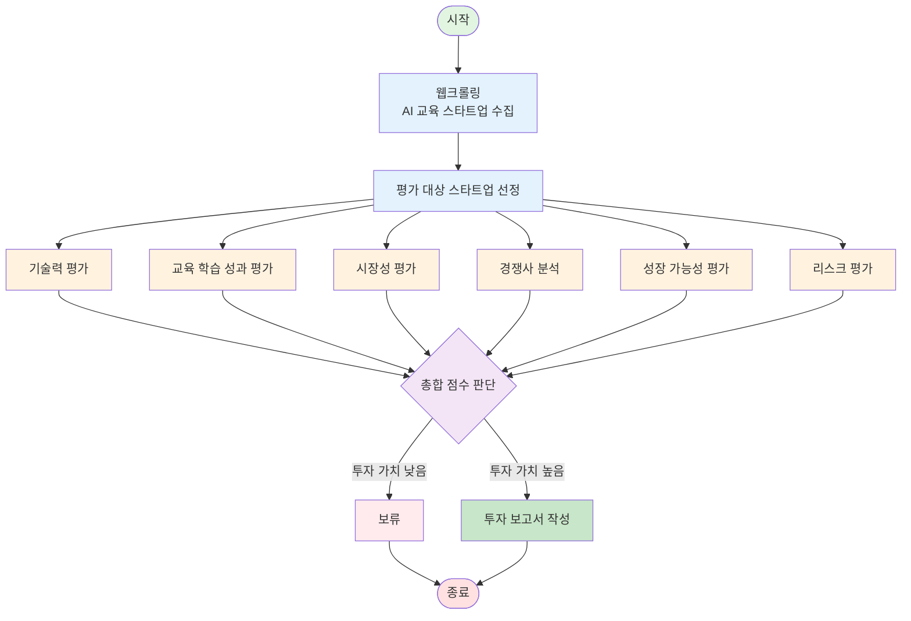

# AI Startup Investment Evaluation Agent
본 프로젝트는 교육 도메인의 AI 스타트업에 대한 투자 가능성을 자동으로 평가하는 에이전트를 설계하고 구현한 실습 프로젝트입니다.

## Overview
- Objective : 교육 분야 기업중 AI 스타트업의 기술력, 교육 학습 성과, 시장성, 경쟁 기업과 비교, 성장 가능성, 리스크를 기준으로 투자 적합성 분석
- Method : AI Agent + Agentic RAG
- Tools : Tavily, OpenAI, LangChain, LangGraph

### Biz Strengths
- 코드 블록을 기능별로 분리하여 모듈화 설계를 적용함
→ 확장성, 유지보수성, 모듈 교체 용이성이 높아짐

- (평가지표 확장을 전제로) 시장성 지수, 기업 판단 지수 등 복합 지표 기반 평가 가능
→ 투자자가 기업을 보다 객관적이고 일관된 기준으로 분석할 수 있음

- 명확한 정량적 평가체계 제공
→ 투자 판단의 불확실성을 줄이고 실패 확률을 감소시키는 데 기여

## Features

- PDF 자료 기반 정보 추출 (예: IR 자료, 기사 등)
- 투자 기준별 판단 분류 (시장성, 팀, 기술력 등)
- 종합 투자 요약 출력 (예: 투자 유망 / 보류 / 회피)

## Tech Stack 

| Category  | Details                         |
| --------- | ------------------------------- |
| Framework | LangGraph, LangChain, Python    |
| LLM       | GPT-4o-mini (via OpenAI API)    |
| Embedding | text-embedding-3-small (OpenAI) |
| Search    | Tavily API (Advanced search)    |
| Storage   | CSV (pandas), Local filesystem  |

## Agents
 
- Web_Crawling_Agent: 웹 크롤링을 통해 교육 AI 스타트업들의 목록을 긁어온다.
- Select_Agent: 목적, 성장 속도, 아이디어, 불확실성, 자금 조달, 최종 목표를 기준으로 스타트업인지 판단한다.
-------------------------------------------------
- Tech_Anal_Agent: 선정된 스타트업의 기술력을 분석한다.
- Learning_Effect_Agnet: 선정된 스타트업의 교육 학습 성과를 분석한다.
- Market_Agent: 선정된 스타트업의 시장성을 분석한다.
- Competition_Agent: 선정된 스타트업의 경쟁사와 비교한다.
- Growth_Potential_Agent: 선정된 스타트업의 성장 가능성을 분석한다.
- Risk_Assesment_Agent: 선정된 스타트업의 리스크를 평가한다.
--------------------------------------------------
- Judgment_Agent: 총합 점수를 통해 보류할지 투자할지 판단한다.
- Repot_Agent: 보류 결정이면 다시 Agnet B로, 투자 결정이면 해당 스타트업의 분석을 보고서로 작성한다.

## Architecture


### 투자 평가 지표
1. 일반 스타트업이 아닌 교육 분야에 최적화된 평가 지표 
2. 성공한 에듀테크 투자 사례 분석(Khan Academy, Duolingo 등)
3. 단기 성과와 장기 잠재력 균형
4. 객관적으로 측정 가능한 지표 우선

### 평가 영역 및 배점 (총 100점)

| 순위 | 평가 영역 | 배점 | 비중 | 주요 평가 내용 |
|:---:|:---|:---:|:---:|:---|
| 1 | 🎓 **교육 효과성** | 25점 | 25% | ESSA 증거 수준, 학습 성과 검증, 학습 과학 기반, 적응형 학습 |
| 2 | 📈 **시장성 & 트랙션** | 20점 | 20% | TAM 규모, 매출 트랙션, 성장률, 고객 유지율, NRR |
| 3 | 👥 **팀 역량** | 20점 | 20% | 창업팀 경험, 팀 완전성, 풀타임 헌신, 네트워크 |
| 4 | 💻 **기술력 & 차별성** | 15점 | 15% | 독자 기술/IP, 제품 성숙도, 확장성, 데이터 활용 |
| 5 | 💰 **비즈니스 모델** | 10점 | 10% | 수익 모델 명확성, Unit Economics, 수익 다각화, 재무 건전성 |
| 6 | 🎯 **경쟁 우위** | 5점 | 5% | 차별화 요소, 진입장벽 |
| 7 | ⚖️ **규제 준수** | 5점 | 5% | 데이터 프라이버시, 접근성, 윤리적 AI |

### 세부 평가 기준

### 시장성 평가 지표

| 평가 항목 | 배점 | 평가 기준 |
|---|---|---|
| 시장 규모 점수 (market_size_score) | 0~25점 | 시장 규모가 클수록 높은 점수 |
| 성장성 점수 (growth_score) | 0~30점 | 성장률(CAGR)이 높을수록 높은 점수 |
| 경쟁 환경 점수 (competition_score) | 0~25점 | 경쟁이 약할수록 높은 점수 (진입장벽 高 = 高점수) |
| 리스크 점수 (risk_score) | 0~20점 | 리스크가 낮을수록 높은 점수 |
| **총점 (total_score)** | **0~100점** | 4개 항목의 합산 점수 |

### 투자적합성 평가 지표
#### 1. 🎓 교육 효과성 (25점)

| 항목 | 배점 | 평가 내용 |
|:---|:---:|:---|
| ESSA 증거 수준 | 10점 | Strong (9-10) / Moderate (6-8) / Promising (3-5) / No Evidence (0-2) |
| 학습 성과 검증 | 8점 | 학업 성취도(4) + 학습 참여도(2) + 만족도(2) |
| 학습 과학 기반 | 5점 | 인지과학 이론(3) + 교육 전문가 참여(2) |
| 적응형 학습 | 2점 | 개인화/맞춤형 학습 제공 |

#### 2. 📈 시장성 & 트랙션 (20점)

| 항목 | 배점 | 평가 기준 |
|:---|:---:|:---|
| TAM 규모 | 5점 | $10B+ (5점) ~ $100M 미만 (1점) |
| 매출 트랙션 | 6점 | $5M+ (6점) ~ Pre-revenue (0-1점) |
| 성장률 | 4점 | 150%+ YoY (4점) ~ 20% 미만 (0점) |
| 고객 유지율 | 3점 | 95%+ (3점) ~ 80% 미만 (0점) |
| NRR | 2점 | 120%+ (2점) ~ 100% 미만 (0점) |

#### 3. 👥 팀 역량 (20점)

| 항목 | 배점 | 평가 기준 |
|:---|:---:|:---|
| 창업팀 경험 | 8점 | CEO(3) + CTO(3) + 교육전문가(2) |
| 팀 완전성 | 5점 | 핵심 역할 충원(3) + 팀 규모 적정성(2) |
| 풀타임 헌신 | 3점 | 모두 풀타임(3) ~ 대부분 파트타임(0) |
| 네트워크 | 4점 | 유명 VC(2) + 교육계 인사(1) + 전문가(1) |

#### 4. 💻 기술력 & 차별성 (15점)

| 항목 | 배점 | 평가 기준 |
|:---|:---:|:---|
| 독자 기술/IP | 6점 | 특허(2) + 핵심 알고리즘(2) + 데이터셋(2) |
| 제품 성숙도 | 4점 | Live & Scaling (4) ~ Idea (0) |
| 확장성 | 3점 | 아키텍처(2) + 비용 구조(1) |
| 데이터 활용 | 2점 | 데이터 축적(1) + 개선 사이클(1) |

#### 5. 💰 비즈니스 모델 (10점)

| 항목 | 배점 | 평가 기준 |
|:---|:---:|:---|
| 수익 모델 | 4점 | B2B SaaS (4) ~ 불명확 (0) |
| Unit Economics | 3점 | LTV/CAC > 3 (3) ~ < 1 (0) |
| 수익 다각화 | 2점 | 2개 이상(2) / 단일(0) |
| 재무 건전성 | 1점 | Runway 12개월+ (1) / 미만 (0) |

#### 6. 🎯 경쟁 우위 (5점)

| 항목 | 배점 | 평가 기준 |
|:---|:---:|:---|
| 차별화 요소 | 3점 | Blue Ocean (3) ~ Me-too (0) |
| 진입장벽 | 2점 | 높음(2) / 중간(1) / 낮음(0) |

#### 7. ⚖️ 규제 준수 (5점)

| 항목 | 배점 | 평가 기준 |
|:---|:---:|:---|
| 데이터 프라이버시 | 3점 | 완벽 준수(3) ~ 미준수(0) |
| 접근성 | 1점 | 장애인/소외계층 고려 |
| 윤리적 AI | 1점 | 편향 제거, 투명성 |

## ⚠️ 리스크 평가

### 6가지 리스크 카테고리

| 리스크 유형 | 평가 요소 | 점수 범위 | 가중치 |
|:---|:---|:---:|:---:|
| 🌍 **시장 리스크** | 시장 규모, 성장성, 경쟁 강도 | 1-10 | 높음 |
| 💻 **기술 리스크** | 기술 검증, 확장성, 개발 난이도 | 1-10 | 높음 |
| 🎯 **실행 리스크** | 팀 역량, 실행 능력, 운영 복잡도 | 1-10 | 높음 |
| 💰 **재무 리스크** | 자금 확보, Runway, Unit Economics | 1-10 | 중간 |
| ⚔️ **경쟁 리스크** | 경쟁 강도, 차별화, 진입장벽 | 1-10 | 높음 |
| ⚖️ **규제 리스크** | 법규 준수, 정책 변화, 규제 이슈 | 1-10 | 낮음 |

### 리스크 수준별 해석

| 전체 점수 | 수준 | 의미 | 투자 권장 |
|:---:|:---:|:---|:---:|
| 9-10점 | 🔴 매우 높음 | 투자 부적합 | ❌ |
| 7-8점 | 🟠 높음 | 신중한 검토 필요 | ⚠️ |
| 5-6점 | 🟡 중간 | 관리 가능한 리스크 | ✅ |
| 3-4점 | 🟢 낮음 | 안전한 투자 | ✅✅ |
| 1-2점 | 🔵 매우 낮음 | 이상적인 투자 | 🌟 |

**전체 리스크 점수** = (6개 리스크 합계) / 6

## 🎯 투자 의사결정

### 투자 등급 체계

| 총점 범위 | 등급 | 투자 결정 | 신뢰도 | 액션 | 예상 성공률 |
|:---:|:---:|:---:|:---:|:---|:---:|
| **80-100점** | S | **Strong Buy** | 높음 | 즉시 투자 추진, 리드 투자 고려 | 80-90% |
| **65-79점** | A | **Buy** | 중-높음 | 투자 권장, 표준 DD 진행 | 60-75% |
| **50-64점** | B | **Hold** | 중간 | 조건부 검토, 3-6개월 관찰 | 40-55% |
| **35-49점** | C | **Watch** | 낮음 | 투자 보류, 6-12개월 후 재평가 | 20-35% |
| **0-34점** | D | **Pass** | 매우 낮음 | 투자하지 않음 | 0-15% |

### 리스크 기반 등급 조정

| 리스크 수준 | 점수 범위 | 조정 규칙 |
|:---:|:---:|:---|
| 매우 높음 (8-10점) | 75점 미만 | **2단계 하향** (Buy → Watch) |
| 높음 (7점 이상) | 80점 미만 | **1단계 하향** (Strong Buy → Buy) |
| 중간 (5-6점) | - | 조정 없음 |
| 낮음 (3-4점) | 60점 이상 | **1단계 상향** 고려 (Hold → Buy) |
| 매우 낮음 (1-2점) | 50점 이상 | **보너스 +3점** |

### 의사결정 프로세스

```
Step 1: 투자 점수 계산 (0-100점)
   ↓
Step 2: 리스크 평가 (1-10점)
   ↓
Step 3: 초기 등급 결정 (S/A/B/C/D)
   ↓
Step 4: 리스크 기반 조정
   ↓
Step 5: 최종 투자 결정
```

## 최종 Score 점수 집계
**점수 현황:**
- 기술력: {tech}/100 (가중치 20%)
- 학습효과: {learning}/100 (가중치 20%)
- 시장성: {market}/100 (가중치 25%)
- 경쟁력: {competition}/100 (가중치 15%)
- 성장가능성: {growth}/100 (가중치 10%)
- 리스크: {risk}/100 (가중치 10%, 높을수록 안전)


## Directory Structure
├── data/                  # 스타트업 list 문서
├── agents/                # 평가 기준별 Agent 모듈
├── outputs/               # 평가 결과 저장
├── app.py                 # 실행 스크립트
└── README.md


## Contributors 
- 김지은 : Evaluation Agent Design
- 심경호 : Prompt Engineering, Architecture Design
- 최휘윤 : Filtering/Selection Agent
- 송재령 : Retrieval agent


## Reference
- [KDI 경제교육 정보센터] (https://eiec.kdi.re.kr/)
- [KERIS 한국교육학술정보원] (https://www.keris.or.kr/main/ad/pblcte/selectPblcteOVSEAList.do?mi=1143)
- [ESSA Evidence Standards](https://essa.ed.gov/)
- [EdTech Investment Trends](https://www.holoniq.com/)
